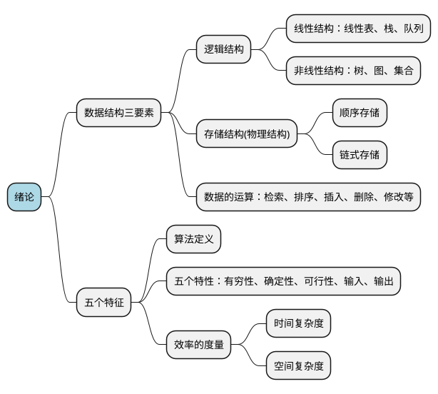

# 第一章绪论




[toc]

## 1. 数据结构的研究内容

 - 用计算机解决一个问题的步骤
    - 具体问题抽象为`数学模型`
        - 分析问题
        - 提取**操作对象**
        - 找出**操作对象之间的关系**
        - 用数学语言描述 -> `数据结构` 
    - 设计算法
    - 编程、调试、运行


- 早期，计算机主要用于**数值计算**。

- 随着计算机应用领域扩展，计算机被越来越多的用于**非数值计算**。
    - 例如`学生管理系统`、棋盘类游戏`人机对弈问题`、文件系统结构`目录`、地图导航`路径问题`等...
    - 这些问题的共性是都无法用数学的公式或方程来描述，是一些“`非数值计算`”的程序设计问题
    - 描述非数值计算问题的数学模型不是数学方程，而是诸如`表`，`树`和`图`之类的具有`逻辑关系`的数据

- 数据结构是一门研究`非数值计算`的程序设计中计算机的`操作对象`以及他们之间的`关系`和`操作`的学科。

## 2. 基本概念和术语

- **`数据`**
    - 是能输入计算机且能被计算机处理的**各种符号的集合**
        - 信息的载体
        - 是对客观事物符号化的表示
        - 能够被计算机识别、存储和加工
    - 包括
        - 数值型的数据：整数、实数等
        - 非数值型的数据：文字、图像、图形、声音等


- **`数据元素`**
    - 是数据的**基本单位**，在计算机程序中通常作为一个整体进行考虑和处理。
    - 也简称为元素，或称为记录、结点或顶点。
    - 一个**数据元素**可由多个**数据项**组成。

- **`数据项`**
    - 构成数据元素的不可分割的**最小单位**。
    - `数据、数据元素、数据项 三者之间的关系`：**数据 > 数据元素 > 数据项**
       
- **`数据对象`**
    - 是**性质相同的数据元素的集合**，是数据的一个子集。
    - 例如
        - **整数**数据对象是集合 `N={0，±1，±2...}`
        - **字母字符**数据对象是集合 `C={’A‘,'B','C'...'Z'}`
        - **学籍表**也可看作一个数据对象

---

- ***`数据元素与数据对象的区别`***
    - **数据元素**--组成数据的基本单位
        - 与数据的关系：集合的`个体`
    - **数据对象**--性质相同的数据元素的集合
        - 与数据的关系：集合的`子集`

---


- **`数据结构`**
    - 数据元素不是孤立存在的，它们之间存在某种关系，**数据元素相互之间的关系称为`结构`(Structure)**
    - 是指**相互之间存在一种或多种特定关系**的数据元素集合
    - 或者说，数据结构是**带结构的**数据元素的集合

### 2.1. 数据结构三要素

- ***`数据结构包括以下三个方面的内容`***
    - 数据元素之间的逻辑关系，也成为`逻辑结构`
    - 数据元素及其关系在计算机内存中的表示(又称为映像)，称为数据的`物理结构`或数据的`存储结构`。
    - 数据的`运算和实现`，即对数据元素可以施加的操作以及这些操作在相应的存储结构上的实现。


- **`数据结构的两个层次`**
    -  **`逻辑结构`**
        - 描述数据元素之间的逻辑关系
        - 与数据的存储无关，独立于计算机
        - 是从具体问题抽象出来的数学模型
    -  **`物理结构(存储结构)`**
        - 数据元素及其关系在计算机存储器中的结构(存储方式)
        - 是数据结构在计算机中的表示
    - **`逻辑结构与存储结构的关系`**
        - 存储结构是逻辑关系的映像与元素本身的映像
        - 逻辑结构是数据结构的**抽象**，存储结构是数据结构的**实现**
        - 两者综合起来建立了数据元素之间的关系


#### 2.1.1. 逻辑结构

- ***`划分方式一--线性和非线性`***
    - **`线性结构`**
        - 有且仅有一个开始和一个终端结点，并且所有结点都最多只有一个直接前驱和一个直接后继。
        - 例如：线性表、栈、队列、串
    - **`非线性结构`**
        - 一个结点可能有多个直接前驱和直接后继
        - 例如：树、图
    
- ***`划分方式二--四种基本逻辑结构`***
    - **`集合结构`**
        - 结构中的数据元素之间除了`同属于一个集合`的关系外，毫无其他关系。
    - **`线性结构`**
        - 结构中的数据元素之间存在着`一对一`的线性关系
    - **`树形结构`**
        - 结构中的数据元素之间存在着`一对多`的层次关系
    - **`图形结构`或`网状结构`**
        - 结构中的数据元素之间存在着`多对多`的任意关系


#### 2.1.2. 存储结构

- ***`四种基本存储结构`***
    - **`顺序存储结构`**
    - **`链式存储结构`**
    - **`索引存储结构`**
    - **`散列存储结构`**

- **`顺序存储结构`**
    - 用一组`连续`的存储单元`依次`存储数据元素，数据元素之间的逻辑关系由元素的`存储位置`来表示。
    - **例如**：C语言中用`数组`来实现顺序存储结构
- **`链式存储结构`**
    - 用一组`任意`的存储单元存储数据元素，数据元素之间的逻辑关系用`指针`来表示。
    - **例如**：C语言中用`指针`来实现链式存储结构。
- **`索引存储结构`**
    - 在存储结点信息的同时，还建立附加的`索引表`
    - 索引表中的每一项都是一个索引项
    - 索引项的一般形式是：(关键字，地址)
- **`散列存储结构`**
    - 根据结点的`关键字`直接计算出该结点的存储地址

### 2.2. 数据类型和抽象数据类型

> - 在使用高级程序语言编写程序时，必须对程序中出现的每个`变量`、`常量`或`表达式`，明确说明它们所属的**数据类型**
>    - 例如，C语言中
>        - 提供`int`、`char`、`float`、`double`等**基本数据类型**
>        - `数组`、`结构体`、`共用体`、`枚举` 等**构造数据类型**
>        - `指针`、`空(void)`类型
>        - 用户还可以用`typedef`**自己定义数据类型**
>    - 一些基本数据结构可以用数据类型来实现，例如数组、字符串等
>    - 而另一些常用的数据结构，如栈、队列、树、图等，不能直接用数据类型来表示
> - 高级语言中的数据类型明显地或隐含地规定了在程序执行期间变量和表达地所有可能地取值范围，以及在这些数值范围上所允许进行地操作。
>    - 例如，C语言中定义变量i为int类型，就表示i是[-min,max]范围的整数，在这个整数集上可以进行+、-、*、\、%等操作
    

- **`数据类型的作用`**
    - 约束变量或常量的`取值范围`
    - 约束变量或常量的`操作`

- **`数据类型(Data Type)`**
    - **定义**：`数据类型`是一组性质相同的**值的集合**以及定义于这个值集合上的**一组操作**的总称。
    - `数据类型 = 值的集合 + 值集合上的一组操作`

- **`抽象数据类型(Abstract Data Type,ADT)`**
    - **是指一个数学模型以及定义在此数据模型上的一组操作**
        - 由用户定义，从问题抽象出`数据模型`(逻辑结构)
        - 还包括定义在数据模型上的一组`抽象运算`(相关操作)
        - 不考虑计算机内的具体存储结构与运算的具体实现算法
    - 抽象数据类型的**形式定义**
        - 抽象数据类型可用`(D,S,P)`**三元组**表示
            - `D` 是`数据对象`
            - `S` 是`D`上的`关系集`
            - `P` 是`D`的`基本操作集`
        
- **一个抽象数据类型的`定义格式`如下**：
    - ADT **抽象数据类型名**{
            `数据对象:<数据对象的定义>`
            `数据关系:<数据关系的定义>`
            `基本操作:<基本操作的定义>`
        }ADT **抽象数据类型名**
     - 其中
        - `数据对象`、`数据关系`的定义用`伪代码`描述
        - **`基本操作`** 的定义格式为
            - 基本操作名(**参数表**)
                - (值传递)赋值参数只为操作提供输入值。
                - (引用传递)引用参数 以&打头，除可提供输入值外，还将返回操作结果
            - **初始条件：<初始条件描述>**
                - 描述操作执行之前数据结构和参数应该满足的条件，如不满足，则操作失败，并返回相应出错信息。若初始条件为空，则省略之。
            - **操作结果：<操作结果描述>**
                - 说明操作正常完成之后，数据结构的变化状况和应返回的结果


- **抽象数据类型的`格式`**

```
ADT 抽象数据类型名{
    Data
        数据对象的定义
        数据元素之间逻辑关系的定义
    Operation
        操作1
            初始条件
            操作结果描述
        操作2
            ...
        操作n
            ...
} ADT 抽象数据类型名
```


- **`抽象数据类型(ADT)`定义举例**
    - Circle的定义
    - 复数的定义


```
ADT Circle{
    数据对象: D = {r,x,y|r,x,y均为实数}
    数据关系: R = {<r,x,y>|r是半径,<x,y>是圆心坐标}
    基本操作:
    Circle(&C,r,x,y)
        操作结果:构造一个圆
    double Area(C)
        初始条件:圆已存在
        操作结果:计算面积
    double Circumference(C)
        初始条件:圆已存在
        操作结果:计算周长
    ...
}ADT Circle

```

```
ADT Complex{
    D = {r1,r2|r1,r2均为实数}
    R = {<r1,r2>|r1是实部,r2是虚部}
    assign(&Z,v1,v2)
        初始条件:空的复数已存在
        操作结果:构造复数C,r1,r2分别赋以参数v1,v2的值
    destory(&Z)
        初始条件:复数已存在
        操作结果:复数被销毁
    GetReal(Z,&realPart)
        初始条件:复数已存在
        操作结果:用realPart返回复数Z的实部值
    GetImg(Z,&imgPart)
        初始条件:复数已存在
        操作结果:用imgPart返回复数Z的虚部值
    Add(Z1,Z2,&sum)
        初始条件:Z1 Z2是复数
        操作结果:用sum返回两个复数的和
    ...
}ADT Complex

```


## 3. 抽象数据类型的表示与实现


> 一个问题抽象为一个抽象数据类型后，仅是形式上的抽象定义，还没有达到问题解决的目的，要实现这个目标，就要把抽象的变成具体的，即抽象数据类型要在计算机上实现，变为一个能用的具体的数据类型。

- **ADT -> C语言实现抽象数据类型 -> 就可以在程序中使用**
    - 用已有的数据类型定义描述它的存储结构
    - 用函数定义描述它的操作


- **`抽象数据类型如何实现`**
    - 抽象数据类型可以通过固有的数据类型(如整型，实型，字符型等)来表示和实现
        - 即利用处理器中已存在的数据类型来说明新的结构，用已经实现的操作来组合新的操作
        
 
> 注：在本门课程的学习过程中，我们使用的**类C语言**(介于伪码和C语言之间)作为描述工具 描述语法见教材P10-11

- **`抽象数据类型实现`举例：用C语言实现抽象数据类型的定义**
    - 抽象数据类型 **复数** 的实现
    - 抽象数据类型 **复数** 的使用
  
---

> 抽象数据类型 **复数** 的实现

```c
typdef struct{
    float realpart; // 实部
    float imagpart;  // 虚部
}Complex

void assign(Complex *A,float real,float imag); // 赋值
void add(Complex *C,Complex A,Complex B);      // A+B
void minus(Complex *C,Complex A,Complex B);    // A-B
void multiply(Complex *C,Complex A,Complex B); // A*B
void divide(Complex *C,Complex A,Complex B);   // A/B

void assign(Complex *A,float real,float imag)
{
    A->realpart = real;
    A->imagpart = imag;
}

void add(Complex *C,Complex A,Complex B) // A+B
{
    C->realpart = A.realpart + B.realpart;// 实部相加
    C->imagpart = A.imagpart + B.imagpart;// 虚部相加
}

...

```


---


---

> 抽象数据类型 **复数** 的使用

例如：计算

$Z=\frac{(8+6i)(4+3i)}{(8+6i)+(4+3i)}$

程序可以这样写

```c

#include <stdio.h>

...

void main()
{
    /***计算***/
    Complex z1,z2,z3,z4,z;
    float RealPart,ImagPart;
    assign(z1,8.0,6.0); //构造复数z1=8+6i
    assign(z2,4.0,3.0); //构造复数z2=4+3i
    add(&z3,z1,z2); // 两个复数相加
    multiply(&z4,z1,z2); // 两个复数相乘
    divide(&z,z3,z4); // 相除
    GetReal(z,RealPart);
    GetImg(z,ImgPart);
    
}
```


---


## 4. 算法和算法分析

### 4.1. 算法

- **`算法的定义`** 
    - 对特定问题**求解方法和步骤**的一种描述，它是`指令`的`有限序列`。其中每个指令表示一个或多个操作。
    - 简而言之，算法就是**解决问题的方法和步骤**
    
- **`算法的描述`**
    - 自然语言：英语、中文
    - 流程图：传统流程图、NS流程图
    - 伪代码：类语言：类C语言
    - 程序代码：C语言，JAVA
    
- **`算法和程序`**
    - **算法**是解决问题的一种方法或一个过程，考虑如何将输入转换成输出，一个问题可以有很多算法
    - **程序**是用某种程序设计语言对算法的具体实现
    - `程序 = 数据结构 + 算法`
        - 数据结构通过算法实现操作
        - 算法根据数据结构设计程序
        

- **`算法的特性：一个算法必须具备以下五个重要特性`**
    - `有穷性`：一个算法必须总是在执行有穷步之后结束，且每一步都在有穷时间内完成。
    - `确定性`：算法中的每一条指令必须有确切的含义，没有二义性，在任何条件下，只有唯一的一条执行路径，即对于相同的输入只能得到相同的输出。
    - `可行性`：算法是可执行的，算法描述的操作可以通过已经实现的基本操作执行有限次来描述。
    - `输入`：一个算法有`零个`或多个输入。
    - `输出`：一个算法有`一个`或多个输出。
    

- **`算法设计的要求`**
    - 正确性
    - 可读性
    - 健壮性：`输入非法数据`后，算法能识别出。
    - 高效性
    


### 4.2. 算法分析

> 算法分析的目的是看算法实际是否可行，并在同一问题存在多个算法时可进行性能上的比较，以便从中挑选出比较优的算法。

- 一个好的算法首先要具备`正确性`，然后是`健壮性`，`可读性`，在几个方面都满足的情况下，主要考虑 **`算法的效率`** ，通过算法的效率高低来评判不同算法的优劣程度。
- 算法效率由以下两个方面来考虑
    - `时间效率`：指的是算法所耗费的`时间`
    - `空间效率`：指的是算法执行过程中所耗费的`存储空间`
- `时间效率和空间效率有时是矛盾的`


#### 4.2.1. 时间复杂度

- **`算法时间效率的度量`**
    - 算法时间效率可以用依据该算法编制的程序在计算机上执行**所消耗的时间**来度量
    - 两种度量方法
        - `事后统计`
            - 将算法实现，测算其时间和空间开销
            - **缺点**：编写程序实现算法将花费较多的时间和精力；所得实验结果依赖于计算机的软硬件等环境因素，掩盖算法本身的优劣。
        - `事前分析`
            - 对算法所消耗资源的一种估算方法。
            
> 因为事后统计在操作上和计算机硬件上差异等不足，我们实际情况中更多的应用`事前分析方法`

- **`事前分析方法`**
    - 一个算法的运行时间是指一个算法在计算机上运行所耗费的时间大致可以等于计算机执行**一种简单的操作(如赋值，比较，移动等)**所需的 **`时间`** 与算法中进行的简单操作**次数`乘积`**
    `算法运行时间 = 一个简单操作所需要的时间 x 简单操作次数`
    - 也就是算法中每条语句的执行时间之和
    `算法运行时间 = Σ 每条语句的执行次数 x 该语句执行一次所需的时间`
    
- **`算法运行时间 = Σ 每条语句频度 x 该语句执行一次所需的时间`**
    - 每条语句执行一次所需的时间，一般是随机器而异的。取决于机器的指令性能、速度以及编译的代码质量。是由机器本身软硬件环境决定的，它与算法无关。
    - 所以我们可**假设每条语句所需的时间均为`单位时间`**。此时对算法的运行时间的讨论就可以转化为讨论该算法中所有语句的执行次数，即频度之和
    - 这就可以独立于不同机器的软硬件环境来分析算法的时间性能了。

---

> 例：两个nxn矩阵相乘的算法可描述为

```c
for(i=1;i<=n;i++) // 第一句 n+1
    for(j=1;j<=n;j++){ // 第二句 n*(n+1)
        c[i][j]=0; // 第三句 n*n
        for(k=0;k<n;k++) // 第四句 n*n*(n+1)
            c[i][j]=c[i][j]+a[i][k]*b[k][j]; // 第五句 n*n*n      
    }
```

- 第一句：运行 `n+1` 次 最后一次判断不通过
- 第二句：运行 `n*(n+1)` 次，循环体内`n`次，判断`n+1`次
- 第三句：运行 `n*n`次，循环体内`n*n`次
- 第四句：运行 `n*n*(n+1)`次
- 第五句：运行 `n*n*n` 次

- 我们把算法所耗费的时间定义为该算法中每条语句的频度之和，则上述算法的时间消耗T(n)为
$$T(n)=2n^3+3n^2+2n+1$$


---


##### 4.2.1.1. 算法时间复杂度的渐进表示法

- 为了便于比较不同算法的时间效率，我们仅比较它们的数量级
    - 例如两个不同的算法时间消耗分别是 $T_1(n) = 10n^2$ 与 $T_2(n) = 5n^3$
- 若有某个辅助函数f(n)，使得当n趋近于无穷大时，T(n)和f(n)的极限值为**不等于零的常数**，则称f(n)是T(n)的同数量级函数。记作$T(n) = O(f(n))$，称$O(f(n))$为算法的渐进时间复杂度(O是数量级的符号)，简称为`时间复杂度`

- 对于求解矩阵相乘问题，算法耗费时间：
$$T(n)=2n^3+3n^2+2n+1$$

$n->\infty,T(n)/n^3->2$，这表示n充分大时，$T(n)$与$n^3$是同阶或同数量级，引入大”O“记号，则$T(n)$可记作：

$$T(n)=O(n^3)$$

**这就是求解矩阵相乘问题的算法的`渐进时间复杂度`**

---

算法中 **`基本语句重复执行的次数`** 是 **`问题规模n`** 的某个函数f(n)，算法的时间量度记作：$T(n)=O(f(n))$

> 它表示随着n的增大，算法执行的时间的增长率和f(n)的增长率相同，称 **`渐近时间复杂度`** 。


---

##### 4.2.1.2. 分析算法时间复杂度的基本方法

- **`分析算法时间复杂度的基本方法`**
    - 找出`语句频度最大`的那条语句作为`基本语句`
    - 计算`基本语句`的`频度`得到问题规模`n`的某个函数`f(n)`
    - 取其数量级用”O“表示

- **`定理1.1`**

若$f(n)=a_mn^m+a_{m-1}n^{m-1}+...+a_1n+a_0$是m次多项式，则$T(n)=O(n^m)$

> 忽略所有`低次幂项`和`最高次幂系数`，体现出增长率的含义

- **`时间复杂度是由嵌套最深层语句的频度决定的`**


---

> 算法时间复杂度分析例题

- 例1：NxN句子相乘：上面已经分析过
- 例2

```c
for(i=1;i<=n;i++)
    for(j=1;j<=i;j++)
        for(k=1;k<=j;k++)
            x=x+1;
```

语句频度=$\sum_{i=1}^{n}\sum_{j=1}^{i}\sum_{k=1}^{j}1=\sum_{i=1}^{n}\sum_{j=1}^{i}j=\sum_{i=1}^{n}\frac{i(i+1)}{2}$
$=\frac{1}{2}(\sum_{i=1}^{n}i^2+\sum_{i=1}^{n}i)$
$=\frac{1}{2}(\frac{n(n+1)(2n+1)}{6}+\frac{n(n+1)}{2})$
$=\frac{n(n+1)(n+2)}{6}$

所以该算法时间复杂度是$T(n)=O(n^3)$

- 例3：分析以下程序段的时间复杂度

```c
i=1; // 语句1
while(i<=n)
    i=i*2;   // 语句2
```

若循环执行1次：`i=1*2=2`
若循环执行2次：`i=2*2=2^2=4`
若循环执行3次：`i=4*2=2^3` 
...
若循环执行x次：`i=2^x`

设语句2执行次数为x次，由循环条件i<=n，可得$2^x<=n$，所以$x<=log_2n$

所以该程序段的时间复杂度为$T(n)=O(log_2n)$


---


- 有的情况下，算法中基本操作重复执行的次数还随问题的输入数据集的不同而不同
    - `最坏时间复杂度`：指在最坏情况下，算法的时间复杂度
    - `平均时间复杂度`：指在所有可能输入实例在等概率出现的情况下，算法的期望运行时间
    - `最好时间复杂度`：指在最好情况下，算法的时间复杂度
    - **`一般总是考虑在最坏情况下的时间复杂度，以保证算法的运行时间不会比它更长`**

---

> 例：顺序查找，在数组a[i]中查找值等于e的元素，返回其所在位置

```c
for(i=0;i<n;i++)
    if(a[i]==e)return i+1;
return 0;
```
- 最好情况：1次
- **`最坏情况`**：n次
- 平均时间复杂度：O(n)

---

- **`对于复杂的算法，可以将它分成几个容易估算的部分，然后利用大O加法法则和乘法法则，计算算法的时间复杂度`**
    - 加法法则
       $T(n)=T_1(n)+T_2(n)=O(f(n))+O(g(n))=O(max(f(n),g(n)))$
    - 乘法法则
       $T(n)=T_1(n)\times T_2(n)=O(f(n))\times O(g(n))=O(f(n)\times g(n))$

- **`当n取得很大时，指数时间算法和多项式时间算法在所需时间上非常悬殊`**

#### 4.2.2. 空间复杂度

- **`空间复杂度`**：算法所需存储空间的度量
记作：$S(n)=O(f(n))$ 其中n为问题的规模(或大小)

- 算法要占据的空间
    - 算法本身要占据的空间，输入/输出，指令，常数，变量等
    - 算法要使用的`辅助空间`
