# 第五章树


## 1. 树与二叉树的定义


### 1.1. 树的定义

- **`树型结构`**(非线性结构)
    - 结点之间有分支
    - 具有层次关系
    - 例如
        - 自然界：树
        - 人类社会：家谱、行政组织机构
        - 计算机领域：编译、数据库系统、算法分析
        
- **`树的定义`**
    - `树(Tree)`是n(n≥0)个结点的有限集
        - 若 n=0 ，称为`空树`；
        - 若 n>0 ，则它满足如下两个条件：
            - **有且仅有一个**特定的称为`根`(Root)的结点
            - **其余结点**可分为m(m≥0)个互不相交的**有限集T1、T2、T3,...,Tm**，其中每一个集合本身又是一棵树，并称为根的**子树(SubTree)**。

- **`树的其他表示方式`**
    - 嵌套集合
    - 凹入表示
    - 广义表


### 1.2. 树的基本术语

- `根结点`：非空树中无前驱结点的结点
- `叶子结点`(终端结点)：度为0的结点
- `分支结点`(非终端结点)：度不为0的结点
- `兄弟结点`：有相同双亲的同一层结点称为兄弟结点
- `堂兄弟结点`：双亲在同一层的结点
- 结点的`度`：结点拥有的子树数
- `树的度`：树内各结点的度的最大值
    - 根结点以外的分支结点称为`内部结点`
- `树的深度`：树中结点的最大层次 
- 结点的子树的根称为该结点的`孩子`，该结点称为孩子的`双亲`
- 结点的`祖先`：从根到该结点所经分支上的所有结点
- 有序树和无序树
    - 有序树：树中结点的各子树从左至右有次序(最左边的为第一个孩子)
    - 无序树：树中结点的各子树无次序
- 森林：是m(m≥0)棵互不相交的树的集合
    - 把根结点删除树就变成了森林
    - 一棵树可以看成是一个特殊的森林
    - 给森林中的各子树加上一个双亲结点，森林就变成了树
    - 树一定是森林，森林不一定是树


#### 1.2.1. 树结构和线性结构的比较

|           线性结构            |               树结构               |
| ---------------------------- | --------------------------------- |
| 第一个数据元素 `无前驱`        | 根结点(只有一个) `无双亲`            |
| 最后一个数据元素 `无后继`       | 叶子结点(可以有多个) `无孩子`        |
| 其他数据元素 `一个前驱一个后继` | 其他结点--中间结点 `一个双亲多个孩子` |
| 一对一                        | 一对多                             |

### 1.3. 二叉树的定义

> 为何要重点研究每结点最多只有两个叉的树？
> - 二叉树的结构最简单，规律性最强
> - 可以证明，所有树都能转化唯一对应的二叉树，不失一般性。

> 普通树(多叉树)若不转化二叉树，则运算很难实现？
> 二叉树在树结构的应用中起着非常重要的应用，因为对二叉树的许多操作算法简单，而任何树都可以与二叉树相互转换，这样就解决了树的存储结构及其运算中存在的复杂性。

- **`二叉树的定义`**
    - `二叉树`是n(n≥0)个结点的有限集，它或者是空集(n=0)，或者由一个**根结点**及`两棵互不相交`的分别称作这个根的**左子树**和**右子树**的二叉树组成。
    - 特点
        - 1、每个结点最多有两孩子(`二叉树中不存在度大于2的结点`)
        - 2、子树有左右之分，其次序不能颠倒
        - 3、二叉树可以是空集合，根可以有空的左子树或空的右子树。

> 注：二叉树不是树的特殊情况，它们是两种概念
> 二叉树结点的子树要`区分左子树`和`右子树`，即使只有一颗子树也要区分，是左子树和右子树
> 树当结点只有一个孩子时，就`不须区分`它是左还是右的次序。因此二者是不同的。这是二叉树和树的最主要的区别

---

> 具有三个结点的二叉树可能有几种不同形态？普通树呢？
二叉树有五种形态
树有两种形态

---


- **`二叉树的五种基本形态`**
    - 空二叉树
    - 根和空的左右子树
    - 根和左子树
    - 根和右子树
    - 根和左右子树

> 虽然二叉树和树概念不同，但是有关树的基本术语都适用于二叉树


## 2. 案例引入

> 案例5.1 数据压缩问题
> 将数据文件转换成由0、1组成的二进制串，称之为编码。

- 等长编码方案
- 不等长编码方案1
- 不等长编码方案2

> 案例5.2 利用而二叉树求解表达式的值

以二叉树表达式的递归定义如下：
- 若表达式为数或简单变量，则相应二叉树中仅有一个根结点，其数据域存放该表达式信息。
- 若表达式为`“第一操作数 运算符 第二操作数”`的形式，则相应的二叉树中以左子树表示第一操作数，右子树表示第二操作数，根结点的数据域存放运算符(若为一元运算符，则左子树为空)，其中，操作数本身又为表达式。


## 3. 树和二叉树的抽象数据结构定义

### 3.1. 二叉树的抽象数据定义

```
ADT BinaryTree{
    数据对象D: D是具有相同特性的数据元素的集合
    数据关系R:
    基本操作P: //至少有20个
        CreateBiTree(&T,definition)
            初始条件: definition给出二叉树T的定义
            操作结果: 按definition构造二叉树T
        PreOrderTraverse(T)
            初始条件: 二叉树T存在
            操作结果: 先序遍历T,对每个结点访问一次
        InOrderTraverse(T)
            初始条件: 二叉树T存在
            操作结果: 中序遍历T,对每个结点访问一次
        PostOrderTraverse(T)
            初始条件: 二叉树T存在
            操作结果: 后序遍历T,对每个结点访问一次
            
        ...
}ADT BinaryTree
```


## 4. 二叉树的性质和存储结构

### 4.1. 二叉树性质

- **`性质1` : 在二叉树的第i层上`至多`有$2^{i-1}$个结点(i≥1)**

证明：采用归纳法证明此性质

> 第i层上至少有 (`1`) 个结点

- **`性质2` : 深度为k的二叉树`至多`有$2^k-1$个结点(k≥1)**

证明：由性质1可知，深度为k的二叉树的最大结点数为

$\sum_{i=1}^{k}(第i层上的最大结点数)=\sum_{i=1}^{k}2^{i-1}$
$=2^0+2^1+...+2^{k-1}$
$=\frac{2^0-2^{k-1}\cdot 2}{1-2}=\frac{1-2^k}{-1}$
$=2^k-1$

证毕

> 深度为k时至少有(`k`)个结点


- **`性质3` : 对任何一棵二叉树T，如果其叶子数为$n_0$，度为2的结点数为$n_2$，则$n_0=n_2+1$**

证明：
从下往上看，每个结点都有唯一一个边，只有根结点没有
总边数为B B=n-1(n为总结点)
从上往下看，总结点分为，有两个边的结点，一个边的结点，没有边的结点，B=2n2+n1
所以$2n_2+n_1=n_0+n_1+n_2-1$
$n_0=n_2+1$


### 4.2. 两种特殊形式的二叉树

- 满二叉树
- 完全二叉树

> 为什么要研究上面两种二叉树?
因为它们在顺序存储下是可以还原的

#### 4.2.1. 满二叉树

- 一棵深度为k且有$2^k-1$个结点的二叉树称为满二叉树

- 特点
    - 1、每一层上的结点数都是最大结点数(即`每层都满`)
    - 2、叶子结点全部在最底层

- 对满二叉树结点位置进行编号
    - 编号规则：从根节点开始，`自上而下，自左而右`
    - 每一结点位置都有元素。

- 满二叉树在同样深度的二叉树中结点个数最多
- 满二叉树在同样深度的二叉树中叶子结点个数最多

#### 4.2.2. 完全二叉树

- 深度为k的具有n个结点的二叉树，当且仅当其每一个结点都与深度为k的满二叉树中编号为1~n的结点一一对应时，称之为完全二叉树。

> 注：在满二叉树中，从最后一个结点开始，`连续`去掉`任意`个结点，即是一个完全二叉树。

- 特点
    - 1、叶子只可能分布在层次最大的两层上
    - 2、对任一结点，如果其右子树的最大层次为i，则其左子树的最大层次必为i或者i+1


#### 4.2.3. 特殊二叉树性质

- **`性质4` : 具有n个结点的完全二叉树的深度为$[log_2^n]+1$**

> 注：[x]：称作x的底，表示不大于x的最大整数

`性质4`表明了完全二叉树结点数n与完全二叉树深度k之间的关系。

- `性质5` : 如果对一棵有n个结点的完全二叉树(深度$[log_2^n]+1$的结点按层序编号(从第1层到第$[log_2^n]+1$层，每层从左到右)，则对任一结点i(1≤i≤n)，有)
    - (1) 如果i=1，则结点i是二叉树的根，无双亲；如果 i > 1，则其双亲是结点$[i/2]$
    - (2) 如果2i>n，则结点i为叶子结点，无左孩子;否则，其左孩子是结点2i。
    - (3) 如果2i+1 > n，则结点i无右孩子；否则，其右孩子是结点2i+1。

`性质5表明了完全二叉树中双亲结点编号与孩子结点编号之间的关系`


### 4.3. 二叉树存储结构

#### 4.3.1. 二叉树的顺序存储

- 实现：按`满二叉树`的结点层次编号，依次存放二叉树中的数据元素。

```c
//二叉树顺序存储表示
#define MAXSIZE 100
typdef TElemType SqBiTree[MAXSIZE]
SqBiTree bt;
```

- 二叉树顺序存储特点
    - 结点间蕴含在其存储位置中
    - 浪费空间，适于存`满二叉树和完全二叉树`

#### 4.3.2. 二叉树的链式存储

- 二叉树结点
    - 数据
    - 左子树指针
    - 右子树指针
    
- 实现：二叉链表存储结构

```c
typedef struct BiNode{
    TElemType data;
    struct BiNode *Lchild,*Rchild; //左右孩子指针
}BiNode,*BiTree;
```

> 在n个结点的二叉链表中，有`n+1`个空指针域

- 三叉链表

```c
typedef struct TriTNode{
    TElemType data;
    struct TriTNode *Lchild,*parent,*Rchild;
}TriTNode,*TriTree;
```


## 5. 遍历二叉树和线索二叉树

- **`遍历定义`**-顺着某一条搜索路径巡访二叉树中的结点，使得每个结点均被访问依次，而且仅被访问一次(又称周游)。
    - "访问"的含义很广，可以是对结点作各种处理，如：输出结点的信息、修改结点的数据值等，但要求这种访问不破坏原来的数据结构。
- **`遍历目的`**-得到树中所有结点的一个线性排列。
- **`遍历用途`**-它是树结构插入、删除、修改、查找和排序运算的前提，是二叉树一切运算的基础和核心

### 5.1. 遍历二叉树

- 遍历方法：依次遍历二叉树中的三个组成部分，便是遍历了整个二叉树
- 假设：L：遍历左子树 D：访问根结点 R：遍历右子树
- 则遍历整个二叉树方案共有：
    - DLR、LDR、LRD、DRL、RDL、RLD共六种


#### 5.1.1. 遍历二叉树算法

- 遍历二叉树算法描述：若规定**先左后右**，则只有前三种情况
    - `DLR`-先(根)序遍历
    - `LDR`-中(根)序遍历
    - `LRD`-后(根)序遍历

|                         先序遍历二叉树                         |                         中序遍历二叉树                         |                         后序遍历二叉树                         |
| ------------------------------------------------------------- | ------------------------------------------------------------- | ------------------------------------------------------------- |
| 若二叉树为空，则空操作；否则                                     | 若二叉树为空，则空操作；否则                                     | 若二叉树为空，则空操作；否则                                     |
| (1) 访问`根`结点<br>(2) `先序遍历`左子树<br>(3) `先序遍历`右子树 | (1) `中序遍历`左子树<br>(2) 访问`根`结点<br>(3) `中序遍历`右子树 | (1) `后序遍历`左子树<br>(2) `后序遍历`右子树<br>(3) 访问`根`结点 |


#### 5.1.2. 根据遍历序列确定二叉树

- 若二叉树中各结点的值均不相同，则二叉树结点的先序序列、中序序列和后序序列都是唯一的。
- 由二叉树的先序序列和中序序列，或由二叉树的后序序列和中序序列可以确定唯一一棵二叉树。

> 如果只知道前序和后序没法确定二叉树


#### 5.1.3. 遍历的递归算法实现

##### 5.1.3.1. 先序遍历


```c
Status PreOrderTraverse(BiTree T){
    if(T==NULL)return OK;//空二叉树
    else{
        visit(T);
        PreOrderTraverse(T->lchild);
        PreOrderTraverse(T->rchild);
    }
}
```

##### 5.1.3.2. 中序遍历

```c
Status InOrderTraverse(BiTree T){
    if(T==NULL)return OK;//空二叉树
    else{
        InOrderTraverse(T->lchild); // 递归遍历左子树
        visit(T); // 访问根节点
        InOrderTraverse(T->rchild); // 递归遍历右子树
    }
}
```

##### 5.1.3.3. 后序遍历

```c
Status PostOrderTraverse(BiTree T){
    if(T==NULL)return OK;//空二叉树
    else{
        PostOrderTraverse(T->lchild); // 递归遍历左子树
        PostOrderTraverse(T->rchild); // 递归遍历右子树
        visit(T); // 访问根节点
        
    }
}
```


##### 5.1.3.4. 遍历算法的分析

- 如果去掉输出语句，从递归的角度看，三种算法是完全相同的，或者说这三种算法的访问路径是相同的，只是访问的时机不同。

- 时间效率：O(n) //每个结点只访问一次
- 空间效率：O(n) //栈占用的最大辅助空间

#### 5.1.4. 遍历的非递归算法

##### 5.1.4.1. 中序遍历非递归算法

- 二叉树`中序遍历的非递归算法的关键`：在中序遍历过某结点的整个左子树后，如何找到该结点的`根`以及`右子树`
- 基本思想：
    - 建立一个`栈`
    - `根`结点`进栈`，遍历`左子树`
    - `根`结点`出栈`，输出根结点，遍历`右子树`

```c

Status InOrderTraverse(BiTree T){
    BiTree p;InitStack(S);p=T;
    while(p||!StackEmpty(S)){
        if(p){Push(S,p);p=p->lchild;}
        else{Pop(S,q);print("%c",q->data);
        p=q->rchild;}
    }
    return OK; 
}
```

#### 5.1.5. 二叉树的层次遍历

- 对于一棵二叉树，从根节点开始，按`从上到下`、`从左到右`的顺序访问每一个结点
- 每个结点仅仅访问一次


##### 5.1.5.1. 二叉树的层次遍历算法

- 算法设计思路：使用一个队列
    - 将根节点进队
    - 队不空时循环：从队列中出列一个结点*p，访问它
        - 若它有左孩子结点，将左孩子结点进队
        - 若它有右孩子结点，将右孩子结点进队


- 顺序队列定义

```c
typedef struct{
    BTNode data[MaxSize]; // 存放队中元素
    int front,rear; // 队头和队尾指针
}SqQueue;//顺序队列类型
```


- 二叉树层次遍历算法

```c
void LevelOrder(BTNode *b){
    BTNode *p;SqQueue *qu;
    InitQueue(qu); // 初始化队列
    enQueue(qu,b); // 根结点指针进入队列
    while(!QueueEmpty(qu)){
        deQueue(qu,p); //出队结点p
        printf("%c",p->data); //访问结点p
        if(p->lchild!=NULL) enQueue(qu,p->lchild); //有左孩子时将其进队
        if(p->rchild!=NULL) enQueue(qu,p->rchild); //有右孩子时将其进队 
    }
}
```
#### 5.1.6. 二叉树遍历算法的运用

##### 5.1.6.1. 建立二叉树

- 按先序遍历序列建立二叉树的二叉链表

(1) 从键盘输入二叉树的结点信息，建立二叉树的存储结构
(2) 在建立二叉树的过程中按照二叉树先序方式建立

```c
Status CreateBiTree(BiTree &T){
    scanf(&ch); //cin>>ch
    if(ch=="#")T=NULL;
    else{
        if(!(T=(BiTNode *)malloc(sizeof(BiTNode))))
            exit(OVERFLOW);//T=new BiTNode;
        T->data=ch; // 生成根结点
        CreateBiTree(T->lchild); //构造左子树
        CreateBiTree(T->rchild); //构造右子树
    }
    return OK;
}
```
 


##### 5.1.6.2. 复制二叉树

- 如果是空树，递归结束
- 否则，申请新结点空间，复制根结点
    - 递归复制左子树
    - 递归复制右子树
    

```c
int Copy(BiTree T,BiTree &NewT){
    if(T==NULL) {//如果是空树返回0
        NewT=NULL;return 0;
    }
    else
    {
        NewT=new BiTNode;
        NewT->data = T->data;
        Copy(T->lchild,NewT->lchild);
        Copy(T->rchild,NewT->rchild);
    }
}


```


##### 5.1.6.3. 计算二叉树深度

- 如果是空树，则深度为0
- 否则，递归计算左子树的深度记为m，递归计算右子树的深度记为n，二叉树的深度则为m与n的较大者+1

```c
int Depth(BiTree T){
    if(T==NULL) return 0;
    else{
        m=Depth(T->lchild);
        n=Depth(T->rchild);
        if(m>n)return (m+1);
        else return n+1;
    }
}
```


##### 5.1.6.4. 计算二叉树结点总数

- 如果是空树，则结点个数为0
- 否则，结点个数为左子树的结点个数+右子树的结点个数+1


```c
int NodeCount(BiTree T)
{
    if(T==NULL)
        return 0;
    else
        return NodeCount(T->lchild)+NodeCount(T->rchild)+1;
}
```

##### 5.1.6.5. 计算二叉树叶子结点数

- 如果是空树，则叶子结点个数为0;
- 否则，为左子树的叶子结点个数+右子树的叶子结点个数

```c
int LeafCount(BiTree T){
    if(T==NULL) //如果是空树返回0
        return 0;
    if(T->lchild==NULL && T->rchild==NULL)
        return 1; //如果是叶子结点返回1
    else
        return LeafCount(T->lchild)+LeafCount(T->rchild);
}
```


### 5.2. 线索二叉树


> 当用二叉链表作为二叉树的存储结构时，可以很方便地找到某个结点的左右孩子；但一般情况下，`无法直接找到该结点在某种遍历序列中的前驱和后继结点`。

- **`提出的问题`**
    - 如何寻址特定遍历序列中二叉树结点的前驱和后继
- **`解决的方法`**
    - 1、通过遍历寻找--费时间
    - 2、再增设前驱、后继指针域--增加了存储负担。
    - 3、`利用二叉链表中的空指针域`。
 
- 二叉树链表空指针域的数量：
具有n个结点的二叉链表中，一共有`2n`个指针域；因为n个结点中有`n-1`个孩子，即2n个指针域中，有n-1个用来指示结点的左右孩子，其余`n+1个指针域为空`。


- 利用二叉链表中的空指针域：
如果某个结点的左孩子为空，则将空的左孩子指针域改为`指向其前驱`；如果某节点的右孩子为空，则将空的右孩子指针域改为`指向其后继`。
----这种`改变指向的指针`称为`"线索"`
加上了线索的二叉树称为`线索二叉树(threaded Binary Tree)`

- 为了区分`lchild` 和`rchild` 指针到底是指向孩子的指针，还是指向前驱或者后继的指针，对二叉链表中`每个结点增设两个标志域` `Itag` 和 `rtag`，并约定：
    - **Itag = 0** lchild指向该结点的**左孩子**
    - `Itag = 1` lchild指向该结点的`前驱`
    - **rtag = 0** rchild指向该结点的**右孩子**
    - `rtag = 1` rchild指向该结点的`后继`
    

结构为

| lchild | `ltag` | data | `rtag` | rchild |
| ------ | ------ | ---- | ------ | ------ |


```c
typedef struct BiThrNode{
    int data;
    int ltag,rtag;
    struct BiThrNode *lchild,rchild;
}BiThrNode,*BiThrTree;
```


## 6. 树和森林

- `树(Tree)`是n(n≥0)个结点的**有限集**。若n=0，称为`空树`；
    - 若**n>0**
        - 有且仅有一个特定的称为`根(root)`的结点
        - 其余结点可分为m(m≥0)个互不相交的**有限集T1，T2，T3，...，Tm**

- 森林：是m(m≥0)棵互不相交的树的集合。

### 6.1. 树的存储结构

#### 6.1.1. 双亲表示法

- `实现`：定义结构数组存放树的结点，每个结点含两个域
    - `数据域`：存放结点本身信息
    - `双亲域`：指示本结点的双亲结点在数组中的位置。
    

- C语言的类型描述(顺序存储)

```c
typedef struct PTNode{
    TElemType data;
    int parent; //双亲位置域
}PTNode;
```

- 树描述

```c
#define MAX_TREE_SIZE 100
typedef struct{
    PTNode nodes[MAX_TREE_SIZE];
    int r,n; //根结点的位置和结点个数
}PTree;
```

> 找双亲容易，找孩子难


#### 6.1.2. 孩子链表

> 把每个结点的孩子结点排列起来，看成是一个线性表，用单链表存储，则n个结点有n个孩子链表(叶子的孩子链表为空表)。而n个头指针有组成一个线性表，用顺序表(含n个元素的结构数组)存储。 


- C语言的类型描述

- 孩子结点结构
```c
typedef struct CTNode{
    int child;
    struct CTNode *next;
}*ChildPtr;
```

- 双亲结点结构

```c
typedef struct{
    TElemType data;
    ChildPtr firstchild; //孩子链表头指针
}CTBox; 
```

- 树结构

```c
typedef struct{
    CTBox nodes[MAX_TREE_SIZE];
    int n,r; //结点数和根结点的位置
}CTree;
```

> 找孩子容易，找双亲难

#### 6.1.3. 孩子兄弟表示法(二叉树表示法，二叉链表表示法)

- 实现：用二叉链表作树的存储结构，链表中每个结点的两个指针域分别指向`第一个孩子结点`和`下一个兄弟结点`。

```c
typedef struct CSNode{
    ElemType data;
    struct CSNode *firstchild,*nextsibling;
}CSNode,*CSTree;
```


### 6.2. 树和二叉树的转换

- 将树转化为二叉树进行处理，利用二叉树的算法来实现对树的操作。
- 由于树和二叉树都可以用二叉链表作存储结构，则以`二叉链表作媒介`可以导出树和二叉树之间的一个对应关系。

#### 6.2.1. 将树转换成二叉树

- 加线：在兄弟之间加一连线
- 抹线：对每个结点，除了其左孩子外，去除其与其余孩子之间的关系。
- 旋转：以树的根结点为轴心，将整树顺时针转45°

> 树变二叉树：兄弟相连留长子

#### 6.2.2. 将二叉树转换成树

- 加线：若p结点是双亲结点的左孩子，则将p的右孩子，右孩子的右孩子...沿分支找到的所有右孩子，都与p的双亲用线连起来
- 抹线：抹掉原二叉树中双亲和右孩子之间的连线
- 调整：将结点按层次排列，形成树结构

> 二叉树变树：左孩右右连双亲，去掉原来右孩线。


### 6.3. 森林和二叉树的转换

- 森林转换成二叉树(二叉树和多棵树之间的关系)
    - 将各棵树分别转换成二叉树
    - 将每棵树的根节点用线相连
    - 以第一棵树根节点为二叉树的根，再以根节点为轴心，顺时针旋转，构成二叉树型结构。
    

- 二叉树转换为森林
    - 抹线：将二叉树中根结点与其右孩子连线，及沿右分支搜索到的所有右孩子之间连线全部抹掉，使之变成孤立的二叉树。
    - 还原：将孤立的二叉树还原成树

> 二叉树变森林：去掉全部右孩线，孤立二叉再还原。

### 6.4. 树和森林的遍历

#### 6.4.1. 树的遍历(三种方式)

- `先根(次序)遍历`：若树不空，则先访问根结点，然后依次先根遍历各棵子树。
- `后根(次序)遍历`：若树不空，则先依次后根遍历各棵子树，然后访问根结点。
- `按层次遍历`：若树不空，则自上而下自左向右访问树中每个结点

#### 6.4.2. 森林的遍历

- 将森林看作由三部分构成
    - 森林中第一棵树的根节点
    - 森林中第一棵树的子树森林
    - 森林中其他树构成的森林


## 7. 哈夫曼树及其应用


### 7.1. 引子

> [例] 将学生的百分制成绩转换成五分制成绩
> - <60：E 
> - 60-69：D
> - 70-79：C
> - 80-89：B 
> - 90-100：A

<table>

<tr>
<td>

```c
if(score<60)
    grade = 'E'
else if(score<70)
    grade = 'D'
else if(score<80)
    grade = 'C'
else if(score<90)
    grade = 'B'
else
    grade = 'A' 
```

</td>
<td>

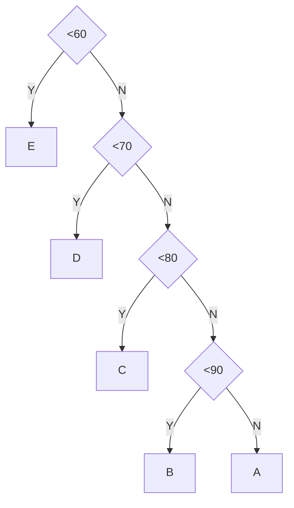

</td>
</tr>
</table>

- `判断树`：用于描述分类过程的二叉树

假设 判定为E的同学比例为5%，D为15%，C为40%，B为30%，A为10%

如果每次的输入量很大，则应考虑程序的操作时间。若学生的成绩数据共10000个：

则5%的数据需要1次比较，15%的数据需2次比较，40%的数据需3次比较，40%的数据需4次比较，因此10000个数据比较的次数为：`10000(1x5%+2x15%+3x40%+4x40%)=31500次`

对上述判断树进行修改

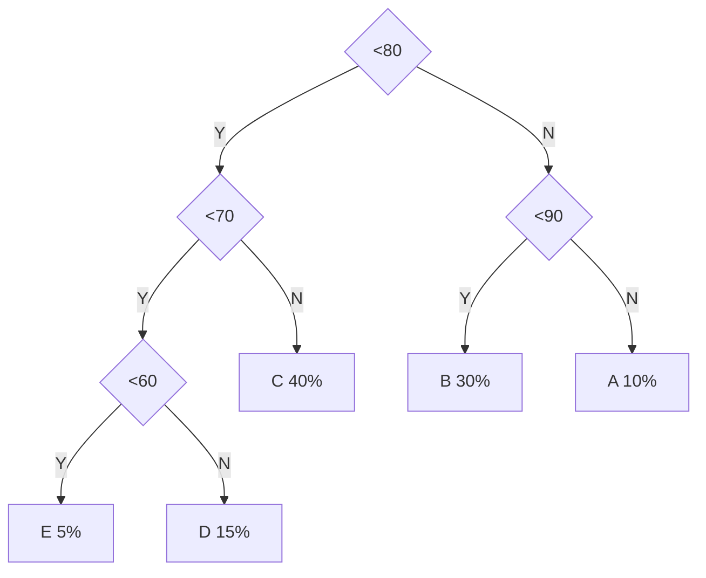


则80%的数据需要2次比较，20%的数据需3次比较，因此10000个数据比较的次数为：`10000(2x80%+3x20%)=22000次`

- 显然这两种判别树的效率是不一样的，那么能不能找到一种效率最高的判别树呢

答案就是`哈夫曼树(最优二叉树)`


### 7.2. 哈夫曼树的基本概念

- `路径`：从树中一个结点到另一个结点之间的**分支**构成这两个结点之间的路径。
- `结点的路径长度`：两结点间路径上的分支数

<table>

<tr>
<td>

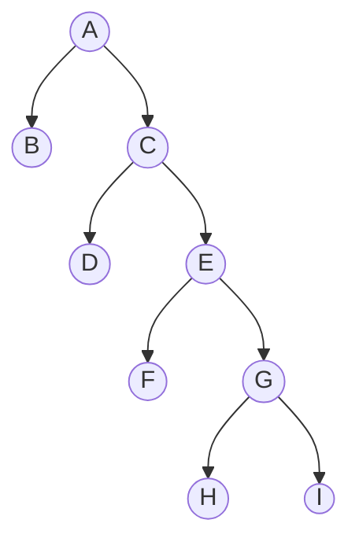


</td>
<td>
(1) 从A到B,C,D,E,F,G,H,I的路径长度分别为1,1,2,2,3,3,4,4<br><br>
(2) 从A到B,C,D,E,F,G,H,I的路径长度分别为1,1,2,2,2,2,3,3

</td>
<td>

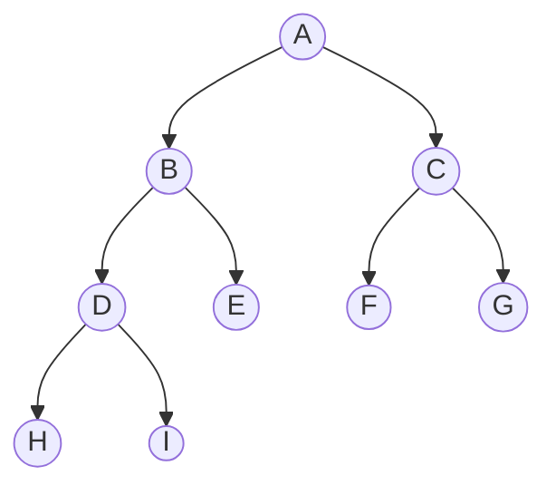

</td>
</tr>
</table>
 
- `树的路径长度`：从`树根`到每一个结点的`路径长度之和`。记作TL

上面
TL(1) = 0+1+1+2+2+3+3+4+4=20
TL(2) = 0+1+1+2+2+2+2+3+3=16

> 结点数目相同的二叉树中，完全二叉树是路径长度最短的二叉树。

- `权(weigt)`：将树中结点赋给一个有着某种含义的数值，则这个数值称为该`结点的权`
- `结点的带权路径长度`：从`根`结点到该结点之间的`路径长度`与该结点的`权`的`乘积`
- `树的带权路径长度(weighted path length)`：树中所有`叶子`结点的`带权路径长度之和`，记作$WPL=\sum_{k=1}^{n}w_kl_k$

> 例：有4个结点 a，b，c，d，权值分别为7，5，2，4，构造以此4个结点为叶子结点的二叉树：


<table>

<tr>
<td>

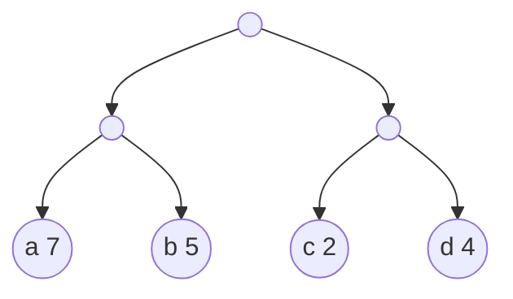

</td>
<td>

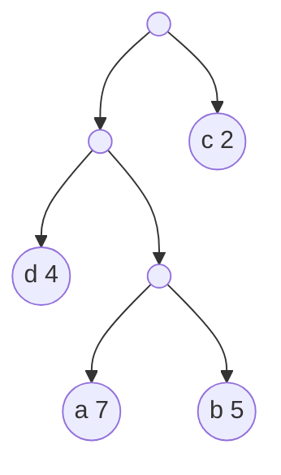

</td>
</tr>
</table>


带权路径长度是：
(1)`WPL=7x2+5x2+2x2+4x2=36`
(2)`WPL=7x3+5x3+2x1+4x2=46`

- `哈夫曼树`：最优树、带权路径长度(WPL)最短的树
- `哈夫曼二叉树`：最优二叉树、带权路径长度(WPL)最短的二叉树


<table>

<tr>
<td>

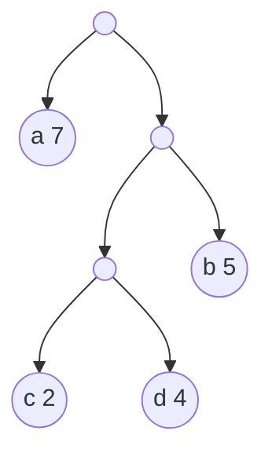

</td>
<td>

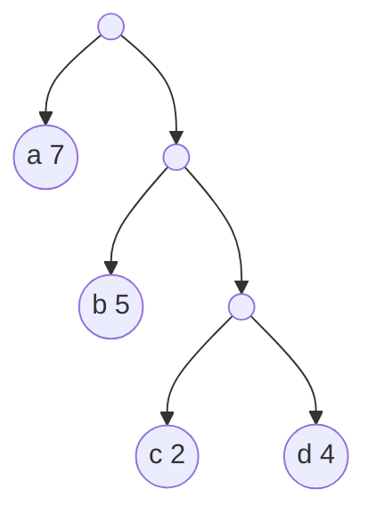

</td>
</tr>
</table>

(1)`WPL=7x1+5x2+2x3+4x3=35`
(2)`WPL=7x1+5x2+2x3+4x3=35`


> 因为构造这种树的算法是哈夫曼教授于1952年提出的，所以被称为`哈夫曼树`，相应的算法称为`哈夫曼算法`。


- **`哈夫曼树特点`**
    - 满二叉树不一定是哈夫曼树
    - 哈夫曼树中权越大的叶子离根越近
    - 具有相同带权结点的哈夫曼树不唯一

### 7.3. 哈夫曼的构造算法

> 哈夫曼树中权越大的叶子离根越近

- 贪心算法：构造哈夫曼树时首先选择权值小的叶子结点

**`哈夫曼算法`(构造哈夫曼树的方法)**
(1) 根据n个给定的权值`{w1,w2,...,wn}`构成n棵二叉树的森林`F={T1,T2,...,Tn}`,其中Ti只有一个带权为`wi`的根结点。
- `构造森林全是根`

(2) 在F中选取两棵根节点的权值最小的树作为左右子树，构造一棵新的二叉树，且设置新的二叉树的结点的权值为其左右子树上根节点的权值之和。

- `选用两小造新树`

(3) 在F中删除这两棵树，同时将新得到的二叉树加入到森林当中。

- `删除两小添新人`

(4)  重复(2)和(3)，直到森林当中只有一棵树为止，这棵树即为哈夫曼树。

- `重复2、3剩单根`


哈夫曼算法口诀：
1、构造森林全是根 2、选用两小造新树
3、删除两小添新人 4、重复2、3剩单根

> 例：有4个结点a，b，c，d，权值分别为7，5，2，4，构造哈夫曼树

<table>

<tr>
<td>

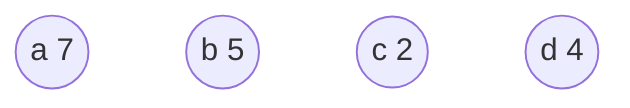

</td>
<td>

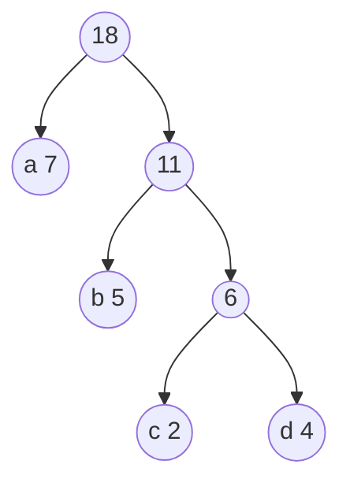

</td>
</tr>
</table>


- 哈夫曼树的结点的度数为0或2，没有度为1的结点
    - 包含n棵树的森林要经过n-1次合并才能形成哈夫曼树，共产生n-1个新结点
- 包含n个叶子结点的哈夫曼树中共有2n-1个结点

> [例] 有5个结点 a,b,c,d,e,权值为7,5,5,2,4,构造哈夫曼树

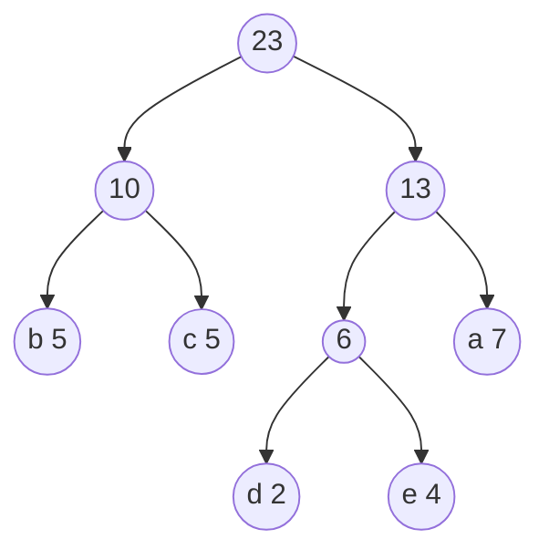


- 总结
    - 在哈夫曼算法中，初始有n棵二叉树，要经过n-1次合并最终形成哈夫曼树。
    - 经过n-1次合并产生n-1个新结点，且这n-1个新结点都是具有两个孩子的分支结点
  
- 可见，哈夫曼树中共有`n+n-1=2n-1`个结点，且其所有的分支结点的度均不为1

### 7.4. 哈夫曼算法实现

- 采用顺序存储结构--一维结构数组
- 结点类型定义

```c
typedef struct{
    int weight;
    int parent,lch,rch; // 双亲 左结点 右结点
}HTNode,*HuffmanTree;
```

哈夫曼树中共有2n-1个结点，不使用0下标，数组大小为2n

#### 哈夫曼构造算法实现

- 1、初始化`HT[1...2n-1]`：lch=rch=parent=0
- 2、输入初始`n个叶子结点`：置HT[1...n]的`weight值`


```c
void CreateHuffmanTree(HuffmanTree HT,int n){ // 构造哈夫曼树
    if(n<=1)return;
    m=2*n-1;//数组共2n-1个元素
    HT=new HTNode[m+1]; //0号单元未用，HT[m]表示根结点
    for(i=1;i<m;++i){
        HT[i].lch=0;HT[i].rch=0;HT[i].parent=0;
    }
    for(i=1;i<=n;i++)cin>>HT[i].weight; //输入前n个元素的weight值
    //初始化结束，下面开始建立哈夫曼树
}
```

- 3、进行以下n-1次合并，依次产生n-1个结点HT[i]，i=n+1...2n-1;
    - 在HT[1...i-1]中选两个未被选过(从parent==0的结点中选)的weight最小的两个结点HT[s1]和HT[s2]，s1,s2为两个最小结点下标
    - 修改HT[s1]和HT[s2]的parent值：HT[s1].parent=i；HT[s2].parent=i;
    - 修改产生新产生的HT[i]：   
        - HT[i].weight=HT[s1].weight+HT[s2].weight
        - HT[I].lch=s1;HT[i].rch=s2;


```c
// 接上
    for(i=n+1;i<=m;i++){
        select(HT,i-1,s1,s2);//在HT[k](1≤k≤i-1)中选择两个其双亲域为0，且权值最小的两个结点，并返回它们在HT中的序号s1和s2
        HT[s1].parent=i;HT[s2].parent=i; // 从F中删除s1，s2
        HT[i].lch=s1;HT[i].rch=s2; //s1,s2分别作为i的左右孩子
        HT[i].weight=HT[s1].weight+HT[S2].weight; //i的权值为左右孩子权值之和       
    }
```

### 7.5. 哈夫曼编码思想

- 在远程通信中，要将待传字符转换成由二进制的字符串
- 设要传送的字符串为：ABACCDA

> 若编码
A-00
B-01
C-10
D-11

ABACCDA->00010010101100

若将编码设计为长度不等的二进制编码，`即让待传字符串中出现次数较多的字符采用尽可能短的编码`，则转换的二进制字符串便可能减少

> 若编码
A-0
B-00
C-1
D-01

ABACCDA->000011010

`关键`：要设计长度不等的编码，则必须任一字符的编码都**不是**另一个字符的编码的**前缀**。

> 问题：什么样的前缀码能使得电文总长最短？

---哈夫曼编码

1、`统计`字符集中`每个字符`在电文中`出现的`平均`概率`(概率越大，要求编码越短)。
2、利用哈夫曼树的特点：权越大的叶子离根越近；`将每个字符的概率值作为权值，构造哈夫曼树`。则概率越大的结点，路径越短。
3、在哈夫曼树的每个分支表上0或1：
    - `结点的做分支标0，右分支标1`
    - 把从根到每个叶子的路径上的标号连接起来，作为该叶子代表的`字符的编码`。


> [例] 要传输的字符集D={C,A,S,T,R}
字符出现频率w={2,4,2,3,3}


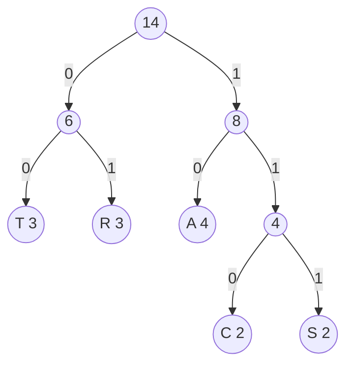


T：00
R：01
A：10
C：110
S：111


> 为什么哈夫曼编码能够保证前缀编码

因为没有一片树叶是另一片树叶的祖先，所以每个叶节点的编码就不可能是其他叶节点编码的前缀

> 为什么哈夫曼编码能够保证字符编码总长最短

因为哈夫曼的带权路径长度最短，故字符编码的总长最短

- **`哈夫曼编码的性质`**
    - 哈夫曼编码是`前缀码`
    - 哈夫曼编码是`最优前缀码`

> [例] 设组成电文的字符集D及其概率分布W为：
D={A,B,C,D,E,F,G}
W={0.40,0.30,0.15,0.05,0.04,0.03,0.03}

> 注：答案不唯一

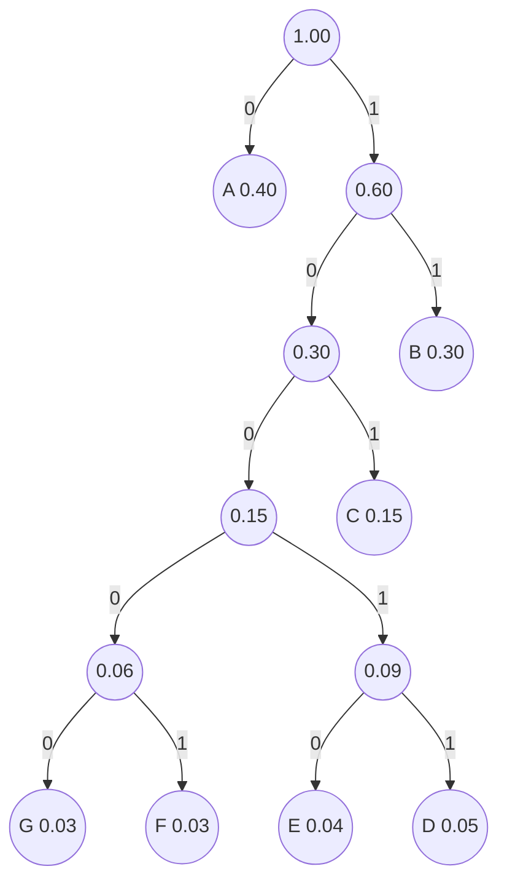

A-0
B-11
C-101
D-10011
E-10010
F-10001
G-10000
 
### 7.6. 哈夫曼编码的算法实现


```cpp
void CreateHuffmanCode(HuffmanTree HT,HuffmanCode &HC,int n)
{
    // 从叶子到根逆向求每个字符的哈夫曼编码，存储在编码表HC中
    HC = new char *[n+1]; // 分配n个字符编码的头指针矢量
    cd = new char [n]; //分配临时存放编码的动态数组空间
    cd[n-1]='\0'; // 编码结束符
    for(i=1;i<=n;++i) // 逐个字符求哈夫曼编码
    {
        start=n-1;c=i;f=HT[i].parent; 
        while(f!=0){ // 从叶子结点开始向上回溯，直到根结点
            --start; // 回溯依次start向前指一个位置
            if(HT[i].lchild==c)cd[start]='0'; // 结点c是f的左孩子，则生成代码0
            else cd[start]='1'; // 结点c是f的右孩子，则生成代码1
            c=f;f=HT[f].parent; //继续向上回溯
        } // 求第i个字符的编码
        HC[i]=new char [n-start]; // 为第i个字符串编码分配空间
        strcpy(HC[i],&cd[start]); // 将球的的编码从临时空间cd复制到HC的当前行中
    }
    delete cd; //释放临时空间
}
```

### 7.7. 文件的编码和译码

- **`1、编码`**
    - 输入个字符及其权值
    - 构造哈夫曼树--HT[i]
    - 进行哈夫曼编码--HC[i]
    - 查HC[i]，得到各字符的哈夫曼编码
 
- **`2、解码`**
    - 构造哈夫曼树
    - 依次读入二进制码
    - 读入0，则走向左孩子，读入1，则走向右孩子
    - 一旦达到某叶子时，即可译出字符
    - 然后再从根出发继续译码，指导结束

## 8. 案例分析与实现