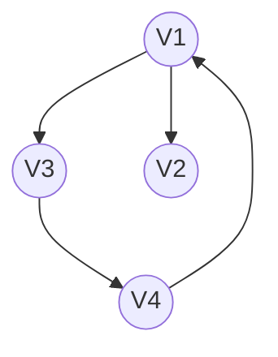
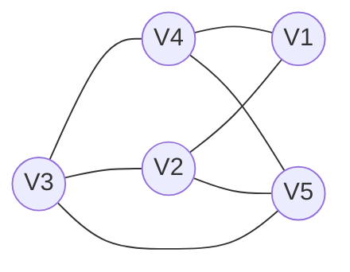
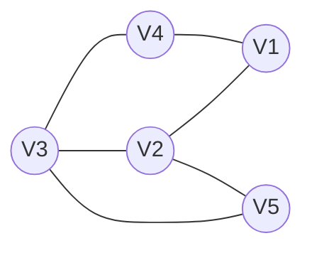

# 第六章图

## 1. 图的定义和基本术语

- **`图`**：G=(V,E)
    - V：顶点(数据元素)的**有穷非空**集合
    - E：边的**有穷**集合
    
- **`无向图`**：每条边都是无方向的
- **`有向图`**：每条边都是有方向的


<table>

<tr>
<td>



</td>
<td>



</td>
</tr>
</table>

- **`完全图`**：任意两个点都有一条边相连
- **`稀疏图`**：有很少边或弧的图(e<nlogn)
- **`稠密图`**：有较多边或弧的图。
- **`网`**：边/弧带权的图
- **`邻接`**：有边/弧相连的两个顶点之间的关系
    - 存在($v_i,v_j$)，则称$v_i$$和$v_j$互为邻接点
    - 存在<$v_i,v_j$>，则称$v_i$邻接到$v_j$，$v_j$邻接于$v_i$
- **`关联(依附)`**：边/弧与顶点之间的关系。
    - 存在($v_i,v_j$)、<$v_i,v_j$>，则称该边/弧关联于$v_i,v_j$
    
- **`顶点的度`**：与该顶点相关联的边的数目，记为TD(v)
- 在`有向图`中，顶点的度等于该顶点的`入度`与`出度`之和。
    - 顶点`v的入度`是以v为终点的有向边的条数，记作ID(v)
    - 顶点`v的出度`是以v为始点的有向边的条数，记作OD(v)
    

> 问：当有向图中仅1个顶点的入度为0，其余顶点的入度均为1，此时是何形状？

答：有向树

- **`路径`**：持续的边构成的顶点序列
- **`路径长度`**：路径上边或弧的数目/权值之和
- **`回路`**：第一个顶点和最后一个顶点相同的路径
- **`简单路径`**：除路径起点和终点可以相同外，其余顶点均不相同的路径。
- **`简单回路(简单环)`**：除路径起点和终点相同外，其余顶点均不相同的路径。
- **`连通图`**
    - 在无(有)向图G=(V,{E})中，若对任何两个顶点v，u都存在从v到u的路径，则称G是`连通图`(强连通图)
- **`权和网`**
    - 图中边或弧所具有的相关数称为`权`。表明从一个顶点到另一个顶点的距离或耗费。
- **`子图`**
    - 设有两个图 G=(V,{E})、G1=(V1,{E1})，若V1⊆V，E1⊆E，则称G1是G的子图
- **`连通分量(强连通分量)`**
    - 无向图G的极大连通子图称为G的连通分量。
    - 极大连通子图意思是：该子图是G连通子图，将G的任何不在孩子图中的顶点加入，子图不再连接
- 有向图G的`极大强连通子图`称为G的`强连通分量`。
    - 极大强连通子图的意思是：该子图是G的强连通子图，将D的任何不在该子图中的顶点加入，子图不再是强连通的。

- **`极小连通子图`**：该子图是G的连通子图，在该子图中删除任何一条边，子图不在连通
- **`生成树`**：包含无向图G所有顶点的极小连通子图
- **`生成森林`**：对非连通图，由各个连通分量的生成树的集合


## 2. 案例引入

> 六度空间理论


## 3. 图的类型定义

```
ADT Graph{
    数据对象V:具有相同特性的数据元素的集合，称为顶点集
    数据关系R:
    基本操作P:
        Creat_Graph(&G,V,VR)
            初始条件:V是图的顶点集，VR是图中弧的集合
            操作结果:按V和VR的定义构造图G
        DFSTraverse(G)
            初始条件:图G存在
            操作结果:对图进行深度优先遍历
        BFSTreverse(G)
            初始条件:图G存在
            操作结果:对图进行广度优先遍历
        
}ADT Graph
```


## 4. 图的存储结构

- 顺序存储结构
    - 图没有顺序存储结构，但可以借助二维数组来表示元素间的关系。
        - 数组表示法(邻接矩阵)
- 链式存储结构 - 多重链表
    - 邻接表
    - 邻接多重表
    - 十字链表
    

- 重点介绍
    - 邻接矩阵(数组)表示法
    - 邻接表(链式)表示法

### 4.1. 邻接矩阵

- 1、**`数组(邻接矩阵)表示法`**
    - 建立一个`顶点表`(**记录各个顶点信息**) 和 一个`邻接矩阵`(**表示各个顶点之间关系**)
        - 设图A=(V,E)有`n`个顶点，则 `顶点表Vexs[n]`
        - 图的邻接矩阵是一个二维数组`A.arcs[n][n]`，定义为：
            - $$A.arcs[i][j]=\left\{
            \begin{aligned}
            &\text{1,如果<i,j>∈E或者(i,j)属于E}  \\
            & 0,否则
            \end{aligned}
            \right.$$

#### 4.1.1. 无向图的邻接矩阵表示法


<table>

<tr>
<td>



</td>
<td>

$$邻接矩阵A.arcs[i][j]=
\begin{array} {cc}
& \begin{array}{ccc}  V_1&V_2&V_3&V_4&V_5\end{array}\\
\begin{array}{c} V_1\\V_2\\V_3\\V_4\\V_5\end{array}&
\left[\begin{array}{ccc}
		0 & 1 & 0 & 1 & 0 \\
		1 & 0 & 1 & 0 & 1 \\
		0 & 1 & 0 & 1 & 1 \\
		1 & 0 & 1 & 0 & 0 \\
		0 & 1 & 1 & 0 & 0 \\ \end{array}\right]
\end{array}
$$

</td>
</tr>
</table>


- 分析1：无向图的邻接矩阵是`对称`的
- 分析2：顶点i的度=第i行(列)中1 的个数
- 特别的，完全图的邻接矩阵中，对角元素为0，其余1

#### 4.1.2. 有向图的邻接矩阵表示法

<table>

<tr>
<td>


</td>
<td>
邻接矩阵

$$
\begin{array} {cc}
& \begin{array}{ccc}  V_1&V_2&V_3&V_4\end{array}\\
\begin{array}{c} V_1\\V_2\\V_3\\V_4\end{array}&
\left[\begin{array}{ccc}
		0 & 1 & 1 & 0 \\
		0 & 0 & 0 & 0  \\
		0 & 0 & 0 & 1  \\
		1 & 0 & 0 & 0  \\
		 \end{array}\right]
\end{array}
$$


</td>
</tr>
</table>

- 注：在有向图的邻接矩阵中 （行出列入）
    - 第i行含义：以结点Vi为尾的弧(即出度边)
    - 第i列含义：以节点Vi为头的弧(即入度边)
    

- 分析1：有向图的邻接矩阵可能是不对称的
- 分析2：
    - 顶点的`出度=第i行元素之和`
    - 顶点的`入度=第i列元素之和` 
    - 顶点的`度=入读+出度=第i行+第i列元素之和`
    

#### 4.1.3. 网(即有权图)的邻接矩阵表示法

定义为

$$A.arcs[i][j]=\left\{
            \begin{aligned}
            &\text{W_{ij},如果<i,j>∈VR或者(i,j)属于VR}  \\
            & ∞,无边(弧)
            \end{aligned}\right.$$


#### 4.1.4. 邻接矩阵的建立

- 邻接矩阵的存储表示：用`两个数组`分别存储`顶点表`和`邻接矩阵`

```c
#define MaxInt 32767 //表示最大值，即∞
#define MVNum 100 //最大顶点
typedef char VerTexType; //设顶点的数据类型为字符型
typedef int ArcType;// 假设边的权值为整型

typedef struct{
    VerTexType vexs[MVNum];//顶点表
    ArcType arcs[MVNum][MVNum]; //邻接矩阵   
    int vexnum,arcnum; // 图的当前点数和边数
}AMGraph;
```

- 采用邻接矩阵表示法`创建无向网`
    - 算法思想
        - 1、输入`总顶点数和总边数`
        - 2、依次输入`点的信息存入顶点表`中
        - 3、`初始化邻接矩阵`，使每个权值初始化为极大值
        - 4、构造邻接矩阵
        
```c
Status CreateUDN(AMGraph &G){
    // 采用邻接矩阵表示法，创建无向网G
    cin>>G.vexnum>>G.arcnum; //输入`总顶点数和总边数`
    for(i=0;i<G.vexnum;++i)
        cin>>G.vexs[i]; // 依次输入`点的信息`
    for(i=0;i<G.vexnum;++i) // 初始化邻接矩阵
        for(j=0;i<G.vexnum;++j)
            G.arcs[i][j]=MaxInt; //边的权值初始化为极大值
    // 构造邻边矩阵
    for(k=0;k<G.arcnum;++k){
        cin>>v1>>v2>>w; //输入一条边所依附的顶点及边的权值
        i = LocateVex(G,v1);
        j = LocateVex(G,v2); //确定v1和v2在G中的位置
        G.arcs[i][j]=w; //边<v1,v2>的权置为w
        G.arcs[j][i]=G.arcs[i][j]; //边<v2,v1>的权也置为w
    }
    return OK;
}
```
补充算法-在图中查找顶点

```c
int LocateVex(AMGraph G,VertexType u){
    int i;
    for(i=0;i<G.vexnum;++i)
        if(u==G.vexs[i]) return i;
    return -1;
}
```

- 无向网引申-无向图和有向图
    - 无向图
        - 1、初始化邻接矩阵时，w均为0
        - 2、构造邻接矩阵时，w为1
    - 有向图
        - 邻接矩阵是非对称矩阵
        - 仅为G.arcs[i][j]赋值

#### 4.1.5. 邻接矩阵表示法的优劣

- 邻接矩阵--有什么好处
    - 直观、简单、好理解
    - 方便检查任意一对顶点间是否存在边
    - 方便找任一顶点的所有"邻接点"(有边直接相连的顶点)
    - 方便计算任一顶点的"度"(从该点出发的边数为"出度"，指向该点的边数为"出度")
        - 无向图:对应行(或列)非零元素的个数
        - 有向图:对应行非零元素的个数为出度，对应列非零元素的个数为入度

- 有什么坏处
    - 不便于增加和删除顶点
    - 浪费空间--存稀疏图(点很多而边很少)有大量无效元素
        - 对稠密图(特别是完全图)还是很合算的
    - 浪费时间--统计稀疏图一共有多少边

### 4.2. 邻接表

- **`邻接表表示法(链式)`**
    - `顶点`
        - 按编号顺序将顶点存储在`一维数组`中
    - `关联同一顶点的边`(以顶点为尾的弧)
        - 用线性`链表`存储

#### 4.2.1. 无向图的邻接表表示法

- 特点
    - 邻接表不唯一
    - 若`无向图`中有n个顶点，e条边，则其邻接表需n个头结点和`2e`个表结点。适宜存储稀疏图。
    - `无向图`中顶点Vi的度为第i个单链表中的结点数
    
#### 4.2.2. 有向图的邻接表表示法

- 特点 (找出度容易，找入度难)
    - 顶点Vi的`出度`为第i个单链表中的结点个数
    - 顶点Vi的`入度`为整个单链表中邻接点域值是i-1的结点个数

解决办法是 新增一个 `逆邻接表`

#### 4.2.3. 邻接表的建立

- 顶点的结点结构

```c
typedef struct VNode{
    VerTexType data; //顶点信息
    ArcNode *firstarc;//指向第一条依附该顶点的边的指针
}VNode,AdjList[MVNum]; //AdjList表示邻接表类型
```
> 说明：`AdjList v;`相当于`VNode v[MVNum];`

- 弧边的结点结构

```c
#define MVNum 100 //最大结点数
typdef struct ArcNode{ //边结点
    int adjvex; //该边所指向的顶点的位置
    struct ArcNode *nextarc; //指向下一个结点的指针
    OtherInfo info; //和边相关的信息
}ArcNode;
```

- 图的结构定义

```c
typedef struct{
    AdjList vertices; //vertices--vertex的复数
    int vexnum,arcnum; //图的当前顶点数和弧数
}ALGraph;
```

##### 4.2.3.1. 采用邻接表建立无向网

- 算法思想
    - 输入`总顶点数`和`总边数`
    - 建立`顶点表`
        - 依次输入点的信息`存入顶点表`中
        - 使每个表头结点的`指针域初始化为NULL`
    - `创建邻接表`
        - 依次输入每条边依附的两个顶点
        - 确定两个顶点的序号i和j，确立边结点
        - 将此边结点插入到Vi和Vj对应的两个边链表的头部 

```c
Status CreateUDG(ALGraph &G){ //采用邻接表创建无向网
    cin>>G.vexnum>>G.arcnum; //输入总顶点，总边数
    for(i=0;i<G.vexnum;++i){ //输入点，构造表头结点表
        cin>>G.vertices[i].data; //输入顶点值
        G.vertices[i].firstarc=NULL; //初始化表头结点的指针域
    }
    for(k=0;k<G.arcnum;++k){ //输入各边，构造邻接表
        cin>>v1>>v2; //输入边依附的两个顶点
        i=LocateVex(G,v1);
        j=LocateVex(G,v2);
        p1 = new ArcNode; //生成一个新的边结点
        p1->adjvex=j;
        p1->nextarc=G.vertices[i].firstarc; 
        G.vertices[i].firstarc=p1;//将新结点*p1插入顶点vi的边表头部
        p2=new ArcNode;
        p2->adjvex=i; //邻接点序号为i
        p2->nextarc=G.vertices[j].firstarc; 
        G.vertices[j].firstarc=p2;//将新结点*p2插入顶点vj的边表头部
        
    }
    return OK;
}
```

#### 4.2.4. 邻接表表示法的特点及与邻接矩阵的关系

- **`特点`**
    - 方便找任一结点的所有"邻接点"
    - 节约稀疏图的空间
        - 需要N个头指针+2E个结点(每个结点至少两个域)
    - 方便计算任一顶点上的度？
        - 对于无向图方便
        - 对有向图不方便，需要逆邻接表
    - 不方便检查任意一对顶点是否存在边

- **`邻接表与邻接矩阵的联系`**
    - 邻接表中每个链表对应邻接矩阵中的一行，链表中结点个数等于邻接矩阵一行中非零元素的个数

- **`邻接表与邻接矩阵的区别`**
    - 1、对任意确定的无向图，邻接矩阵是`唯一`的(行标号与顶点编号一致)，但邻接表`不唯一`(链接次序与顶点编号无关)
    - 2、邻接矩阵的空间复杂度为$O(n^2)$，而邻接表的空间复杂度为$O(n+e)$

- 用途
    - 邻接矩阵多用于稠密图，邻接表多用于稀疏图


#### 4.2.5. 邻接表的缺点及其改进

- 邻接表缺点
    - 有向图：求结点的度困难 -> `十字链表`
    - 无向图：每条边都要存储两遍 -> `邻接多重表`

### 4.3. 十字链表

- 十字链表是有向图的另一种链式存储结构。我们也可以把它看作是将有向图的邻接表和逆邻接表结合起来的一种链表
- 有向图的每一条弧对应十字链表中的一个`弧结点`，同时有向图中的每个顶点在十字链表中对应有一个结点，叫`顶点结点`。

 
### 4.4. 邻接多重表


## 5. 图的遍历

- 遍历定义
    - 从已给的连通图中某一顶点出发，沿着一些边访遍图中所有的顶点，且使每个顶点仅被访问一次，就叫做**图的遍历**，它时图的`基本运算`。
    -  遍历实质：找每个顶点的邻接点的过程。

- 图的特点
    - 图中可能存在`回路`，且图的任一顶点都可能与其他顶点相通，在访问完某个顶点之后可能会沿着某些边又回到了曾经访问过的顶点。
    - 怎么避免重复访问？
    - 解决思路：设置**`辅助数组`**`visited[n]`，用来标记每个被访问过的顶点。
        - 初始状态：`visited[i]为0`
        - `顶点i被访问，改visited[i]为1`，防止被多次访问


### 5.1. 深度优先搜索 DFS

方法

- 在访问图中的某一起始点`v`后，由v出发，访问它的`任一邻接顶点w1`;
- 再从w1出发，访问`与w1邻接`但还`未被访问`过的顶点w2；
- 然后再从w2出发，进行类似的访问，...
- 如此进行下去，直至到达所有的邻接顶点都被访问过的顶点u为止
- 接着，退回一步，退到前一次刚访问过的顶点，看是否还有其它没有被访问的邻接顶点。
- 如果有，则访问此顶点，之后再从此顶点出发，进行与前述类似的访问。
- 如果没有，就再退回一步进行搜索。重复上述过程，直到连通图中所有顶点都被访问过为止。

> 连通图的深度优先遍历类似于树的先根遍历

#### 5.1.1. 深度优先搜索遍历算法的实现

- 采用邻接矩阵表示图的深度优先搜索遍历

```c
void DFS(AMGraph G,int v){
    cout<<v;visited[v]=true; //访问第v个顶点
    for(w=0;w<G.vexnum;w++) //依次检查邻接矩阵v所在的行
        if((G.arsc[v][v]!=0)&&(!visited[w]))
            DFS(G,w);
        // w是v的邻接点，如果w未访问，则递归调用DFS
}
```


### 5.2. 广度优先搜索 BFS

方法：从图的某一结点出发，首先依次访问该结点的所有邻接点Vi1，Vi2，...，Vin再按这些顶点被访问的先后次序依次访问与它们相邻接的所有未被访问的顶点。
重复此过程，直至所有顶点均被访问为止。

#### 5.2.1. 广度优先搜索遍历算法的实现

- 按广度优先非递归遍历连通图G

```c
//按广度优先非递归遍历连通图G
void BFS(Graph G,int v){
    cout<<v;visited[v]=true; // 访问第v个顶点
    InitQueue(Q); // 辅助队列Q初始化，置空
    EnQueue(Q); // v进队
    while(!QueueEmpty(Q)){ // 队列非空
        DeQueue(Q,u); //队头元素出队并置为u
        for(w=FirstAdjVex(G,u);w>=0;w=NextAdjVex(G,u,w));
        if(!visited[w]){//w为u的尚未访问的邻接顶点
            cout<<w;visited[w]=true;EnQueue(Q,w);//w进队
        }
        
    }
    
    
}
```

- 如果使用邻接矩阵，则BFS对于每一个访问到的顶点，都要循环检测矩阵中的整整一行(n个元素)，总的时间代价为O(n^2)
- 用邻接表来表示图，虽然有2e个表结点，但只需扫描e个结点即可完成遍历，加上访问n个头结点的时间，时间复杂度为O(n+e)


#### 5.2.2. DFS和BFS算法效率比较

- 空间复杂度相同，都是`O(n)`(借用了堆栈和队列)
- 时间复杂度只与存储结构(`邻接矩阵和邻接表`)有关，而与搜索路径无关。

## 6. 图的应用

### 6.1. 最小生成树

- **`生成树`**：所有顶点均由边连接在一起，但`不存在回路`的图。
    - 一个图可以有许多棵不同的生成树
    - 所有生成树具有以下共同特点
        - 生成树的顶点个数与图的`顶点个数相同`
        - 生成树是图的`极小连通子图`，去掉一条边则非连通。
        - 一个有n个顶点的连通图的生成树有`n-1`条边。
        - `在生成树中再加一条边必然形成回路`。
        - 生成树中任意两个顶点间的`路径是唯一`的
        - 一个图可以有许多棵不同的生成树
        - 所有生成树具有以下共同特点
        - 含n个顶点n-1条边的图不一定是生成树
        

- 无向图的生成树
    - 深度优先生成树
    - 广度优先生成树


- 最小生成树
    - 给定一个无向网络，在该网的所有生成树中，使得`各边权值之和最小`的那棵生成树称为该网的`最小生成树`，也叫**最小代价生成树**。
    

- **`最小生成树的典型用途`**
    - 欲在n个城市间建立通信网，则n个城市应铺设n-1条线路
    - 但因为每条线路都会有对应的经济成本，而n个城市最多有`n(n-1)/2`条线路，那么，`如何选择n-1条线路，使总费用最少 ? `
        - 顶点--表示城市，有n个
        - 边--表示线路，有n-1条
        - 边的权值--表示线路的经济代价
        - 连通网--表示n个城市间通信网
        
#### 6.1.1. 构造最小生成树 Minimum Spanning Tree

构造最小生成树的算法很多，其中多数算法都利用了`MST`的性质。

- 构造最小生成树方法一：`普里姆(Prim)算法`

- 构造最小生成树方法二：`克鲁斯卡尔(Krushal)算法`

两种算法比较

|   算法名   |     普里姆算法     |   克鲁斯卡尔算法   |
| ---------- | ----------------- | ----------------- |
| 算法思想   | 选择点            | 选择边            |
| 时间复杂度 | O(n^2)(n为顶点树) | O(eloge)(e为边数) |
| 适应范围   | 稠密图            | 稀疏图            |


### 6.2. 最短路径

- `典型用途`：**交通网络的问题**--从甲地到乙地之间是否有公路连通? 在有多条通路的情况下，哪一条路最短?
- 交通网络用有向网来表示：
    - 顶点：表示地点
    - 弧：表示两个地点有路连通
    - 弧上的权值：表示两地点之间的距离、交通费或途中所花费的时间等
- 如何能够使一个地点到另一个地点的运输时间最短或运费最省？这就是一个求两个地点间的`最短路径问题`。

- 问题抽象：在有向网中 `A点(源点)` 到达 `B点(终点)` 的多条路径中，寻找一条各边权值之和最小的路径，即`最短路径`。·
    - 最短路径与最小生成树不同，路径上不一定包含n个顶点，也不一定包含`n-1`条边。

- 第一类问题：两点间最短路径
- 第二类问题：某源点到其它各点最短路径

- **`两种常见的最短路径问题`**：
    - 单源最短路径-用`Dijksta(迪杰斯特拉)`算法
    - 所有顶点间的最短路径-用`Floyd(弗洛伊德)`算法
    


### 6.3. 拓扑排序

- **有向无环图**：无环的有向图，简称**DAG图**(Directed Acycline Graph)
    - 有向无环图常用来描述一个工程或系统的进行过程。(通常把计划、施工、生产、程序流程等当成是一个工程)
    - 一个工程可以分为若干个子工程，只要完成了这些子工程(活动)，就可以导致整个工程的完成。
    
- **有向无环图及其应用**
    - AOV网 `拓扑排序`
        - 用一个有向图表示一个工程的各子工程及其相互制约的关系，其中以**`顶点表示活动，弧表示活动之间的优先制约关系`**，称这种有向图为`顶点表示活动的网`，简称`AOV网`(Activity On Vertex network)
    - AOE网 `关键路径`
        - 用一个有向图表示一个工程的各子工程及其相互制约的关系，以`弧度表示活动`，以`顶点表示活动的开始或结束事件`，称这种有向图为`边表示活动的网`，简称`AOE网`(Activity On Edge)。


### 6.4. 关键路径


- 把工程计划表示为**`边表示活动的网络`**，即**`AOE网`**，用顶点表示`事件`，弧表示`活动`，弧的权表示 `活动持续时间`。
`事件`表示在它之前的活动已经完成，在它之后的活动可以开始。


## 7. 案例分析与实现