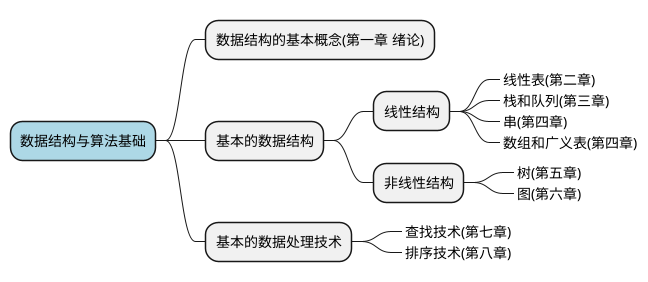

# readme

## 课程视频资源

- 数据结构与算法基础（青岛大学-王卓）
https://www.bilibili.com/video/BV1nJ411V7bd/

- 青岛大学王卓老师B站号
https://space.bilibili.com/40323036

## 课程框架

$$程序 = 数据结构 + 算法$$

## 参考书籍

- [数据结构（C语言版） 严蔚敏 / 吴伟民](https://book.douban.com/subject/24699581/)

- [《数据结构》算法实现及解析第二版高一凡](https://book.douban.com/subject/1232045/)

- [数据结构考研复习指导](https://book.douban.com/subject/34951478/)

